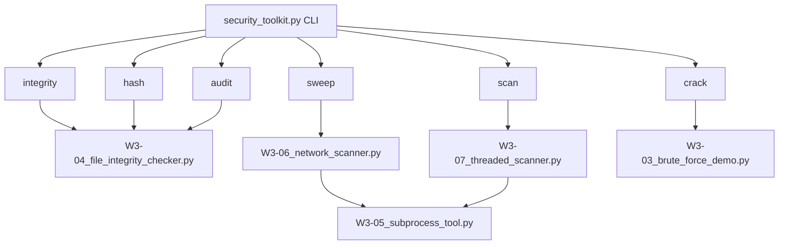

# Python Security Toolkit — Week 03

---

> **ETHICAL USE & LEGAL WARNING**
>
> This software is intended exclusively for authorized security testing,
> defensive security research, academic study, and controlled lab environments.
>
> Unauthorized use of these tools against systems, networks, or infrastructure
> you do not own or have explicit written authorization to test may constitute
> a criminal offence under the Computer Fraud and Abuse Act (CFAA), the UK
> Computer Misuse Act, and equivalent legislation in your jurisdiction.
>
> Users are solely responsible for ensuring lawful operation of this software.
> Authorization must be obtained in writing before interacting with any
> system or network not under your direct control.
>
> Credential material and sensitive configuration must be secured appropriately.
> Do not commit secrets, passwords, or private keys to version control.
>
> The maintainers of this project disclaim all liability for misuse, damage,
> data loss, legal consequence, or illegal activity arising from use of this
> software. Use at your own risk, within the law, with explicit authorization.

---

## Project Overview

This repository is a structured collection of Python security tools developed
as part of a university-level cybersecurity curriculum. It covers foundational
security engineering topics including cryptographic hashing, password storage,
file integrity monitoring, network reconnaissance, packet crafting, and static
analysis.

**Intended audience:** Security engineering students, defensive security
practitioners, and developers studying Python security tooling.

**Scope:** Educational and lab use only. All tools target localhost or
authorized lab networks unless explicitly configured otherwise.

**Design philosophy:** Every tool in this repository is written to demonstrate
not only the security concept it illustrates, but also how that concept should
be implemented securely in production. Code is hardened against the same
classes of vulnerability it demonstrates.

---

## Architecture & Components

```
week03-python-security/
├── scripts/                  # Individual security tool modules
│   ├── W3-01_hash_demo.py
│   ├── W3-02_password_hasher.py
│   ├── W3-03_brute_force_demo.py
│   ├── W3-04_file_integrity_checker.py
│   ├── W3-05_subprocess_tool.py
│   ├── W3-06_network_scanner.py
│   ├── W3-07_threaded_scanner.py
│   ├── W3-08_env_config.py
│   └── W3-09_scapy_demo.py
├── tools/
│   └── security_toolkit.py   # Unified CLI entry point
├── tests/
│   └── test_security_tools.py
├── wordlists/
│   └── demo_wordlist.txt     # 100 fake/demo entries only
├── .env.example
├── .gitignore
├── requirements.txt
└── README.md
```

**Operational flow:**



All modules are imported lazily inside their respective CLI handler functions —
only the modules required for the invoked subcommand are loaded at runtime.

---

## Feature & Tool Breakdown

### W3-01 — Hash Demo

Demonstrates the operational differences between cryptographic hash functions
at varying security levels: MD5, SHA-1, SHA-256, SHA-512, and PBKDF2-HMAC-SHA256.

**Concepts demonstrated:**
- Determinism: identical inputs always produce identical digests
- Avalanche effect: a single bit change produces an entirely different digest
- Computational cost: MD5 executes in microseconds; PBKDF2 at 600,000 iterations
  executes in ~300ms — the difference that defeats dictionary attacks
- Password hashing: PBKDF2 with a random 16-byte salt and 600,000 iterations

**Operational notes:**
- Password loaded from `DEMO_PASSWORD` environment variable — never hardcoded
- MD5 usage is intentional and suppressed with `# nosec B324` with documented
  justification — it is the subject of the demonstration, not a production choice

---

### W3-02 — Password Hasher

OWASP-compliant password hashing, verification, and in-memory storage
implementation. Demonstrates production-grade password handling patterns.

**Implementation:**
- bcrypt with cost factor 12 (approximately 250ms per operation)
- Unicode normalisation (NFC) applied before encoding — prevents encoding
  inconsistencies across platforms
- SHA-256 pre-hashing applied before bcrypt — mitigates bcrypt's 72-byte
  silent truncation limit, safely supporting passwords up to 128 characters
- Account lockout after 5 consecutive failed authentication attempts
- Password reuse prevention on change
- Vague error messages — authentication failures do not reveal whether the
  username or password was incorrect

**`PasswordStore` operations:**

| Method | Description |
|--------|-------------|
| `add_user(username, password)` | Validates, hashes, and stores credentials |
| `authenticate(username, password)` | Verifies credentials with lockout tracking |
| `change_password(username, old, new)` | Re-authenticates before accepting new password |
| `save(filepath)` | Persists store to JSON with path traversal protection |
| `load(filepath)` | Loads and validates store from JSON |

**Thread safety:** All reads and writes to `_passwords` and `_failed_attempts`
are guarded by `threading.Lock()`.

---

### W3-03 — Brute Force Demo

Demonstrates dictionary attack mechanics against MD5-hashed passwords using
both sequential and threaded execution. Contrasts attack speed against MD5
versus bcrypt to illustrate why algorithm choice is a primary defence.

**What this demonstrates:**
- A 100-entry wordlist cracks MD5 hashes in milliseconds
- The same wordlist against bcrypt requires multiple seconds per attempt
- Threading provides measurable speedup against weak hashes — and is
  irrelevant against bcrypt due to per-attempt cost

**Security controls in this script:**
- Wordlist path validated against path traversal via `_safe_path()`
- Cracked passwords are never logged — only attempt count and word length
- Worker count capped at `MAX_WORKERS = 8`
- bcrypt demo password loaded from `DEMO_PASSWORD` environment variable

---

### W3-04 — File Integrity Checker

SHA-256 baseline creation and verification tool. Detects new, modified, and
deleted files in a monitored directory by comparing current hashes against
a saved baseline.

**Operational modes:**

| Flag | Description |
|------|-------------|
| `--baseline <dir>` | Hash all files and save baseline to JSON |
| `--verify <dir>` | Compare current state against saved baseline |
| `--watch <dir>` | Continuously verify at configurable interval |

**`IntegrityReport` output:**
- New files: files present now but absent at baseline time
- Deleted files: files present at baseline but now absent
- Modified files: files present in both but with changed digests
- Unchanged: count of files matching baseline exactly

**Security controls:**
- All paths validated via `_safe_path()` — traversal rejected
- `rglob()` capped at `MAX_FILES = 100,000` — prevents resource exhaustion
- Watch interval minimum 5 seconds — prevents tight polling loops
- File hashing reads in 8192-byte chunks — handles arbitrarily large files
  without loading them into memory

---

### W3-05 — Subprocess Tool

A hardened subprocess execution wrapper that enforces `shell=False` on all
invocations, validates all arguments before execution, and blocks dangerous
commands.

**`SafeShell` capabilities:**

| Method | Description |
|--------|-------------|
| `run(command, timeout)` | Execute validated command list; return stdout, stderr, returncode |
| `run_with_input(command, input_data)` | Execute with piped stdin; return stdout or None |
| `ping(host)` | Validate host then ping; return bool |
| `get_open_ports(host)` | nmap scan with socket fallback for common ports |
| `get_process_list()` | Parse `ps aux` output into structured dicts |

**Validation layers:**
- All arguments type-checked as strings before execution
- Shell metacharacters `[;&|` \`$<>\\]` rejected via regex
- Blocked commands: `rm`, `dd`, `mkfs`, `shutdown`, `reboot`
- Hostname and IP validated via regex before any network call
- Rate limiting: minimum 1 second between network calls
- All exceptions caught internally — `str(e)` never returned to caller

---

### W3-06 — Network Scanner

CIDR-range ping sweep using `SafeShell.ping()` with configurable thread
pool execution. Optionally chains into port scanning via `ThreadedPortScanner`.

**Usage requires explicit authorization.** Default targets should be
`127.0.0.1` or a lab network you control.

**Controls:**
- CIDR validated via `ipaddress.ip_network()` before any scanning begins
- `.hosts()` used — broadcast and network addresses excluded automatically
- Worker count capped at `MAX_WORKERS = 20`
- `compare_speed()` benchmark gated behind `--compare-speed` flag —
  does not execute automatically

---

### W3-07 — Threaded Port Scanner

Sequential and threaded TCP port scanner with optional banner grabbing.
`ThreadedPortScanner` extends `PortScanner` with concurrent execution
via `ThreadPoolExecutor`.

**Features:**
- `scan_port(port)` — single port probe with optional banner grab
- `scan_range(start, end)` — range scan with bounds validation
- `scan_common()` — scans 120 well-known service ports
- `ScanResult` dataclass — structured output with port, state, banner, timing

**Banner sanitisation:** Raw banner bytes are decoded with
`errors="ignore"`, stripped of non-printable characters via regex, and
capped at 256 characters. This prevents log injection via attacker-controlled
banner content.

**Controls:**
- Target validated via regex before `socket.gethostbyname()` resolution
- Port range validated: 1–65535, start ≤ end
- Worker count capped at `MAX_WORKERS = 50`
- Raw input never echoed in error messages

---

### W3-08 — Environment Config

Type-safe environment variable accessor with coercion, validation, and
consistent error handling. Wraps `os.environ` with typed getters that
never expose key names in user-facing exceptions.

**Methods:**

| Method | Returns | Behaviour on missing |
|--------|---------|---------------------|
| `get(key, default)` | `str \| None` | Returns default |
| `require(key)` | `str` | Raises `ConfigError` |
| `get_int(key)` | `int` | Returns 0 |
| `get_bool(key)` | `bool` | Returns False |
| `get_list(key, separator)` | `list` | Returns [] |
| `validate(required_keys)` | None | Raises `ConfigError` if any missing |

**Design:** Configuration key names are considered internal structure.
They are logged internally on failure but never included in exceptions
raised to callers.

---

### W3-09 — Scapy Demo

Packet crafting fundamentals using Scapy. All operations target
`127.0.0.1` (loopback) exclusively. Demonstrates the layered packet
model, field inspection, sniffing, and raw byte dissection.

**Sections:**
1. Basic IP/TCP structure — layer composition, field inspection
2. ICMP echo request/reply on loopback
3. TCP SYN packet — manual construction and layer-by-layer inspection
4. Sniff 10 packets on loopback interface
5. Sniff with BPF filter: TCP only
6. Dissect raw bytes back into a parsed Scapy object

**Platform note:** Requires Linux or Kali for full raw socket support
(`AF_PACKET`). macOS restricts raw socket access at the kernel level.
Requires `sudo` for all send/receive/sniff operations.

---

### tools/security_toolkit.py — Unified CLI

Single entry point exposing all tool capabilities as argparse subcommands.
Prints an ethical use warning on every invocation. Modules are imported
lazily — only the module required for the active subcommand is loaded.

**Subcommands:**

| Command | Flags | Delegates to |
|---------|-------|-------------|
| `integrity` | `--baseline`, `--verify`, `--output`, `--baseline-file` | `FileIntegrityChecker` |
| `scan` | `--host`, `--workers` | `ThreadedPortScanner` |
| `sweep` | `--network`, `--workers` | `NetworkScanner` |
| `hash` | `--file` | `FileHasher` |
| `crack` | `--hash`, `--wordlist`, `--algorithm` | `HashCracker` |
| `audit` | `--dir` | `FileHasher.hash_directory()` |

---

## Security Architecture & Engineering Decisions

### Password hashing: bcrypt at cost factor 12

**Threat:** Fast hash functions (MD5, SHA-256) can be computed at billions
of operations per second on commodity GPU hardware. A 100-million-entry
wordlist is exhausted in seconds.

**Mitigation:** bcrypt is computationally expensive by design. Cost factor 12
produces approximately 250ms per hash on modern hardware — making a
dictionary attack against a single account take years rather than seconds.

**Tradeoff:** Authentication latency is measurably higher than with fast
hashes. This is acceptable and intended. DoS via repeated authentication
is mitigated by account lockout after 5 failed attempts.

### bcrypt 72-byte truncation: SHA-256 pre-hashing

**Threat:** bcrypt silently truncates input at 72 bytes. Passwords longer
than 72 bytes produce the same hash as their first 72 bytes — two distinct
passwords may authenticate interchangeably.

**Mitigation:** Passwords are SHA-256 hashed before passing to bcrypt.
The SHA-256 digest is always exactly 64 hex characters — well within the
72-byte limit. Passwords of any length produce distinct bcrypt inputs.

**Tradeoff:** Slightly reduced entropy at the bcrypt layer (SHA-256 output
space rather than raw password space). In practice this is not a meaningful
reduction.

### No `shell=True` in any subprocess call

**Threat:** `shell=True` passes the command string to `/bin/sh`. Any
unsanitised user input in the command string enables shell injection —
a semicolon or pipe character executes an arbitrary second command.

**Mitigation:** All subprocess calls use `shell=False` with a list argument.
The OS `execve()` syscall receives the argument list directly — there is no
shell process, no string interpolation, and no injection surface.

**Tradeoff:** Pipelines and shell builtins cannot be used directly. This
is acceptable — complex shell logic belongs in dedicated scripts, not
inline subprocess calls.

### Secrets in environment variables, not source

**Threat:** Secrets hardcoded in source are committed to version control.
Git history is permanent — a secret committed and later deleted remains
recoverable. Public repositories expose credentials globally.

**Mitigation:** All secrets are loaded from environment variables via
`os.getenv()` and `python-dotenv`. `.env` is excluded from version
control via `.gitignore`. `.env.example` documents required variables
without exposing values.

**Tradeoff:** Deployment requires environment configuration. This is
standard operational practice and not a meaningful burden.

### Path traversal prevention via `_safe_path()`

**Threat:** `open("../../etc/passwd")` silently escapes the intended
working directory. Any tool accepting a filepath from user input or
command-line arguments is potentially vulnerable.

**Mitigation:** All filepath arguments are resolved to absolute paths
via `Path.resolve()` and compared against the allowed base directory.
Any path resolving outside the base is rejected before any file
operation is attempted.

**Tradeoff:** Tools cannot operate on files outside the working directory
without modifying the allowed base. This is intentional.

### Generic error messages, internal logging

**Threat:** Detailed error messages — stack traces, file paths, key names,
exception text — constitute reconnaissance data. An attacker observing
error responses can map internal directory structure, configuration, and
system state.

**Mitigation:** All exceptions are caught at the boundary. Detailed
information is logged internally via `logging`. Callers receive generic
messages that confirm failure without revealing cause or location.

### Thread safety via `threading.Lock()`

**Threat:** Shared mutable state accessed from multiple threads without
synchronisation produces race conditions. In authentication contexts, a
race on failed attempt counters could allow more attempts than the lockout
threshold permits.

**Mitigation:** All shared dictionaries (`_passwords`, `_failed_attempts`,
`results`) are protected by `threading.Lock()`. Locks are acquired for
the minimum scope necessary.

### Worker pool caps via `MAX_WORKERS` constants

**Threat:** Unbounded thread pools can exhaust system file descriptors,
trigger out-of-memory conditions, or generate network traffic volumes
that trigger intrusion detection on target systems.

**Mitigation:** Each concurrent tool defines a named `MAX_WORKERS`
constant validated at instantiation. The constant is visible in source,
documented, and adjustable per deployment.

### Banner sanitisation in port scanner

**Threat:** Network service banners are attacker-controlled data. A
malicious service can return bytes designed to exploit log parsers,
terminal emulators, or downstream processing — including ANSI escape
sequences and non-printable control characters.

**Mitigation:** Banner bytes are decoded with `errors="ignore"`,
filtered to printable ASCII via regex (`[^\x20-\x7E]`), and capped at
256 characters before any logging or display.

---

## Installation & Setup

### Prerequisites

- Python 3.11 or later
- pip
- Linux or Kali Linux recommended (required for Scapy and raw socket tools)
- `sudo` access for scan, sweep, and packet crafting operations
- nmap (optional — used by `get_open_ports()` if available)

### Setup

```bash
# Clone the repository
git clone <repository-url>
cd week03-python-security

# Create and activate virtual environment
python3 -m venv env
source env/bin/activate

# Install dependencies
pip install -r requirements.txt

# Configure environment
cp .env.example .env
# Edit .env:
# DEMO_PASSWORD=<your-demo-password>

# Verify static analysis passes
bandit -r . --exclude ./env -ll
```

### Verify installation

```bash
python tools/security_toolkit.py --help
```

Expected output lists all six subcommands with descriptions.

---

## Quick Start

```bash
# Hash a file
python tools/security_toolkit.py hash --file scripts/W3-01_hash_demo.py

# Audit a directory
python tools/security_toolkit.py audit --dir scripts/

# Create integrity baseline
python tools/security_toolkit.py integrity \
    --baseline scripts/ \
    --output baseline.json

# Verify against baseline
python tools/security_toolkit.py integrity \
    --verify scripts/ \
    --baseline-file baseline.json

# Port scan localhost (requires sudo)
sudo python tools/security_toolkit.py scan --host 127.0.0.1

# Crack a demo hash
python tools/security_toolkit.py crack \
    --hash 5f4dcc3b5aa765d61d8327deb882cf99 \
    --algorithm md5 \
    --wordlist wordlists/demo_wordlist.txt
```

---

## Configuration Reference

| Variable | Required | Description |
|----------|----------|-------------|
| `DEMO_PASSWORD` | Yes | Password used in hashing and bcrypt demos |
| `DEBUG` | No | Enable debug-level logging (default: false) |
| `MAX_CONNECTIONS` | No | Reserved for future use |

All variables are documented in `.env.example`. Copy to `.env` before
first run. Never commit `.env` to version control.

---

## Detailed Usage Examples

### File integrity monitoring

```bash
# Baseline your scripts directory
python tools/security_toolkit.py integrity \
    --baseline scripts/ \
    --output baseline.json

# Modify a file to simulate tampering
echo "# tampered" >> scripts/W3-01_hash_demo.py

# Verify — should report one modified file
python tools/security_toolkit.py integrity \
    --verify scripts/ \
    --baseline-file baseline.json
```

Expected output:
```
Integrity Report — 2025-01-15 14:32:01

New files (0):

Deleted files (0):

Modified files (1):
  ~ scripts/W3-01_hash_demo.py

Unchanged: 8
```

### Port scanning

```bash
# Scan common ports on localhost
sudo python tools/security_toolkit.py scan --host 127.0.0.1

# Scan with custom worker count
sudo python tools/security_toolkit.py scan --host 127.0.0.1 --workers 10
```

### Dictionary attack demo

```bash
# Crack a known MD5 hash against the demo wordlist
python tools/security_toolkit.py crack \
    --hash 5f4dcc3b5aa765d61d8327deb882cf99 \
    --wordlist wordlists/demo_wordlist.txt \
    --algorithm md5
```

Output confirms crack attempt count and word length — the cracked
word itself is never logged.

### Running individual scripts

```bash
# Hashing demo
python scripts/W3-01_hash_demo.py

# Password hasher
python scripts/W3-02_password_hasher.py

# Brute force demo
python scripts/W3-03_brute_force_demo.py

# File integrity
python scripts/W3-04_file_integrity_checker.py \
    --baseline . --output baseline.json

# Scapy (Kali Linux, requires sudo)
sudo python scripts/W3-09_scapy_demo.py
```

---

## Logging, Auditing & Monitoring

All modules use Python's `logging` module. No `print()` statements are
used for operational output in production paths.

**What is logged:**
- Operation start and completion
- Error conditions with type (not content)
- Attempt counts in cracking operations
- File counts and hash failures in integrity operations
- Worker activity in threaded operations

**What is never logged:**
- Passwords or password hashes
- Cracked plaintext values
- Full file paths in error conditions
- Exception text (`str(e)`) in any user-facing output
- Configuration key names
- Banner content before sanitisation

**Retention:** No log persistence is implemented. Output is written to
stdout/stderr. Production deployments should redirect to a structured
logging system with appropriate retention policies.

---

## Threat Model & Limitations

### Trust assumptions
- The operator has authorization to interact with all target systems
- The wordlist contains only fictional or intentionally weak credentials
- The `.env` file is protected by filesystem permissions
- The host running these tools is under operator control

### Known limitations
- Scapy operations require Linux kernel raw socket support — macOS support
  is partial and requires workarounds
- `ThreadedPortScanner` performs TCP connect scans only — SYN scans require
  raw sockets and root privileges via Scapy
- `NetworkScanner` uses ICMP ping via `SafeShell` — hosts configured to
  drop ICMP will appear offline regardless of actual state
- `FileIntegrityChecker` detects file modification by hash change — it does
  not detect in-memory tampering or kernel-level rootkits
- No persistent storage — `PasswordStore` is in-memory only; data does not
  survive process termination without explicit `save()`

### Abuse scenarios
- These tools can be used for unauthorized reconnaissance if misused
- The brute force module demonstrates attack techniques that are effective
  against MD5-protected systems
- Packet crafting via Scapy can be used to craft malicious traffic

All of the above are why ethical use and written authorization are
non-negotiable prerequisites.

---

## Secure Development Practices

### Static analysis

```bash
# Run on every commit — zero MEDIUM or HIGH findings required
bandit -r . --exclude ./env -ll
```

Intentional use of weak algorithms in demo scripts is suppressed with
`# nosec <rule>` and a documented justification comment inline.

### Dependency management

```bash
# Audit dependencies for known vulnerabilities
pip audit

# Pin all dependencies for reproducible installs
pip freeze > requirements.txt
```

### Secrets handling
- Never commit `.env`
- Rotate `DEMO_PASSWORD` if the `.env` file is ever exposed
- Use a secrets manager in any production deployment

### CI/CD recommendations
- Run `bandit -r . --exclude ./env -ll` on every push
- Run `pip audit` on every dependency change
- Require passing static analysis before merge
- Protect the main branch — no direct pushes

---

## Contributing

1. Fork the repository and create a feature branch
2. Follow the security hardening checklist in `week03-notes.md`
3. All new scripts must pass `bandit -r . --exclude ./env -ll`
4. All file operations must use `_safe_path()`
5. No secrets in source — environment variables only
6. No `shell=True` — ever
7. Open a pull request with a clear description of changes

**Responsible disclosure:** If you identify a security issue in this
codebase, open a private issue or contact the maintainer directly before
public disclosure.

---

## License

This project is released for educational use. You are free to use, modify,
and distribute this code for lawful purposes with attribution.

This software is provided as-is, without warranty of any kind. The
maintainers accept no liability for damages, data loss, or legal
consequences arising from use of this software.

Use of this software for unauthorized access to computer systems is
prohibited and may constitute a criminal offence. Users are solely
responsible for compliance with applicable law.